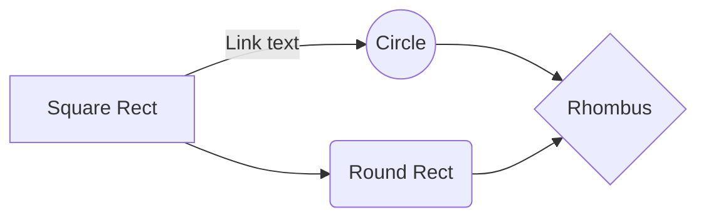

Source code
-----------

If you have to insert code in your document you have three choices:

 1. inline code like this: `*Hello* **world!**"`
 2. fenced code blocks (you may use ` ``` ` or `~~~` 
   as delimiters): 
``` markdown
*Hello* **world!**
```
 3. indented code blocks


    *Hello* 
    
    **world!**

You need to leave a blank linke after a paragraph and 2 blank lines after a list to start an indented code block (if you want the code to be out of the list), and you may insert the name of the language immediatly after the opening code fence (so some renderers may be able to highlight the syntax of the language)

You can also insert Mermaid diagrams



MathJax formulas

$$\left( \sum_{k=1}^n a_k b_k \right)^2 \leq \left( \sum_{k=1}^n a_k^2 \right) \left( \sum_{k=1}^n b_k^2 \right)$$

and Alert blocks

> [!NOTE]
> Useful information that users should know, even when skimming content.

> [!TIP]
> Helpful advice for doing things better or more easily.